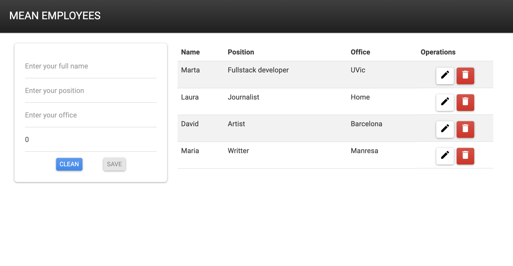

<!-- PROJECT TITLE -->
<br />
<div align="center">

<h2 align="center">MEAN STACK</h3>
<p align="center"> This is a simple MEAN CRUD project</p>
<br />
</div>
<br/>

## About the project

In order to achieve a broader knowledge in tech stacks I've created this simple project that combines the use of M. MongoDB, E. Express, A. Angular, N. Node.js.

Here's why -> :rocket: [go fullstack!](https://martaboteller.com/fullstack)

<br/><br/>

## Description



<h5>On the left hand side of the screen there is a form that allows insertion of new records. On the right hand side there is a table that displays the data from MongoDB (persistance) and allows the edition/deletion of rows.</h5>

<br/><br/>

## Built with

Major frameworks/libraries used:

  

  

  

  
  
<br/><br/>

## What's included

I've been working with two main folders: frontend & backdend.

The structure of the frontend is as follows:

```
frontend/
└── src/
    └─── app/
        ├── components/
        │   └─ employee/
        │      └─ employee.component.ts
        ├── models/
        │   └─ employee.ts
        └── services/
            └─ employee.service.ts
```

The structure of the backend is as follows:

```
server/
└── public/
└── src/
    ├── controllers/
    │   └─ employees.controller.js
    ├── models/
    │   └─ Employee.js
    ├── routes/
    │   └─ employee.routes.js
    ├── app.js
    ├── database.js
    └── index.js
```

<br/>

## Start local MongoDB

```
mongod --config /usr/local/etc/mongod.conf --fork
```

## Heroku preparation

<br/>

###### _At angular.json:_

```javascript
"options": {"outputPath": "../server/public",...
```

###### _Create the frontend dist:_

```
ng build
```

###### _At employee.service.ts_ - redefine URL_API

```
readonly URL_API = 'api/employees';
```

###### _Use env variables:_

```javascript
require('dotenv').config();
```

```
process.env.MONGO_CONNECTION_STRING
proess.env.PORT
```

###### _Define static route:_

```javascript
app.use(express.static(path.join(__dirname, '../public')));
```

###### _Redirect to frontend:_

```javascript
app.get('/', function (req, res) {
  res.sendFile('../public/index.html');
});
```

<br/><br/>

## Heroku deployment

<br/>

###### _Git preparation:_

```javascript
git init
git add .
git commit -m 'message'
```

###### _Heroku preparation:_

```javascript
heroku login
heroku create -a example-app
git remote -v //list all remote projects
heroku git:remote -a example-app
```

###### _Deploy:_

```javascript
git push heroku master
```

<br/><br/>

## Roadmap

- [x] Configure with local MongoDB database
- [x] Configure with atlas MongoDB database
- [x] Form validation check
- [x] Heroky deployment
- [ ] Resposive frontend
- [ ] Convert .subscribe() -> observables

<br/>

## Author

I'm Marta Boteller, little more about me at my [website](https://martaboteller.com).
<br/> <br/>

## Acknowledgments

<p>List of helpful resources I would like to give credit: </p>

- [How To Develop and Build MEAN Stack - Bhargav Bachina](https://medium.com/bb-tutorials-and-thoughts/how-to-develop-and-build-mean-stack-355bd0c23a68)
- [Fazt code chanels](https://www.youtube.com/c/FaztCode)
- [How to Build a RESTful API Using Node, Express, and MongoDB - Nishant Kumar](https://www.freecodecamp.org/news/build-a-restful-api-using-node-express-and-mongodb/)
- [Node.js Express: JWT example | Token Based Authentication & Authorization - Bezcoder](https://www.bezkoder.com/node-js-jwt-authentication-mysql/)
- [CRUD con el stack MEAN - Diario del programador](https://diarioprogramador.com/crud-con-el-stack-mean/)
- [MEAN Stack CRUD Operations Using Angular Material Datatable - Manav Pandya](https://www.dotnettricks.com/learn/angularmaterial/datatable-crud-operations-mean-stack)
- [MEAN - Crea una app Mean con Docker y Angular - Jose Luís García Martínez](https://www.jolugama.com/blog/2018/11/09/app-mean-angular-docker/)
